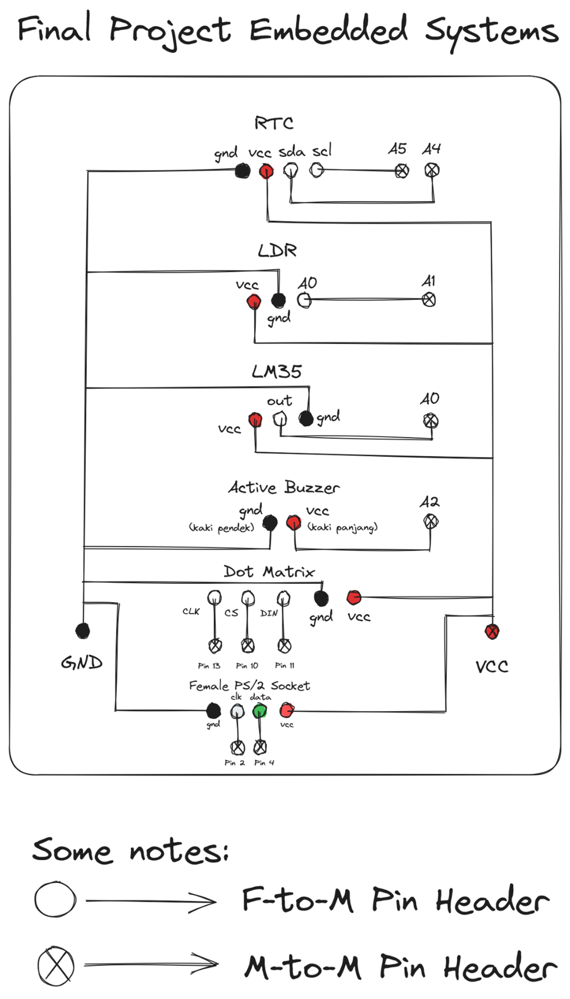
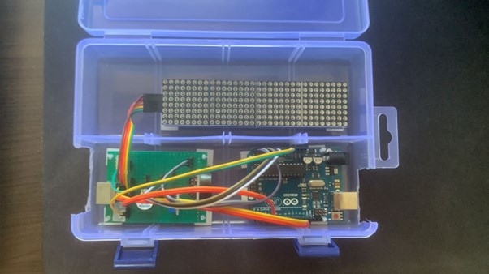
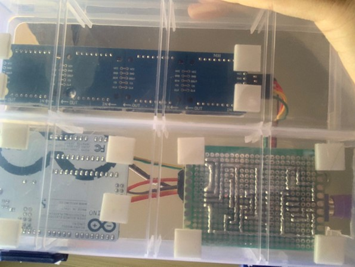
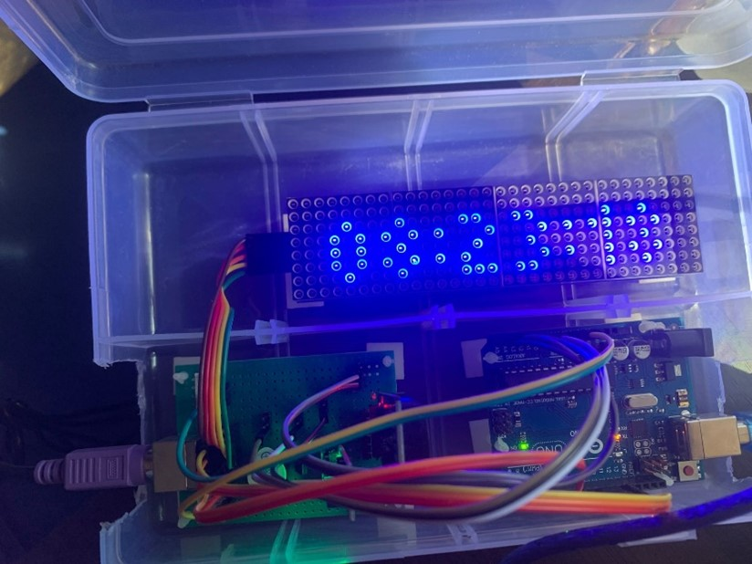
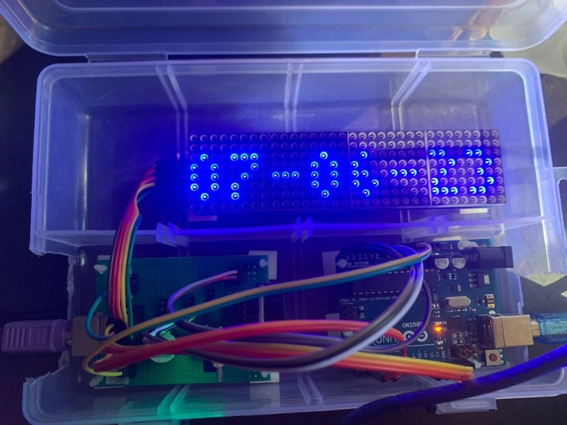
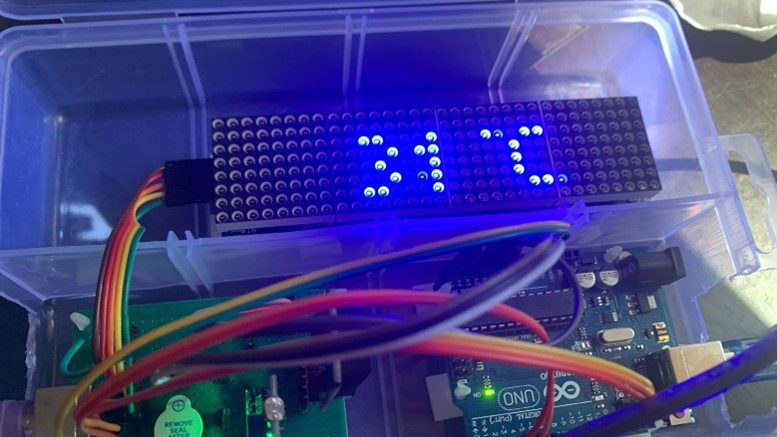

# Digital Alarm Clock with Dot Matrix display - Arduino

## Part of Embedded Systems College Course

~1 month long final project

### Table of Contents

<ul>
    <li><a href="#features">Features</a></li>
    <li><a href="#made-with">Made with</a></li>
    <li><a href="#pcb-design">PCB Design</a>
    </li>
    <li><a href="#final-product">Final Product</a></li>
    <li><a href="#how-to-navigate-product">How to navigate product</a></li>
</ul>

### Features

1. Real time clock, Calendar, Temperature display
   - if clock/calendar is wrong, it can be configured with PS/2 Keyboard
2. Alarms,
   - Can be configured with PS/2 Keyboard to,
     - set when alarms start/end
     - set text to display when an alarm starts
   - Alarm types:
     - alarm-1 and alarm-2, will output hardcoded defined text into Dot Matrix display
     - alarm-3, will output text from PS/2 Keyboard input into Dot Matrix Display
3. Dot Matrix Display will change brightness according to surroundings,
   - if surrounding is bright, brightness is bright
   - if surrounding is not bright, brightness is dimmed

### Made with

- Arduino UNO
  - libraries includes,
    - [Adafruit_GFX.h](https://github.com/adafruit/Adafruit-GFX-Library)
      - Fonts/Picopixel.h
    - [Max72xxPanel.h](https://github.com/markruys/arduino-Max72xxPanel)
      - This one makes it possible to interact with Dot Matrix using Adafruit_GFX.h
    - [DS3232RTC](https://github.com/JChristensen/DS3232RTC)
      - Controls RTC
    - [LM35](https://github.com/wilmouths/LM35)
      - Interfacing with LM35 made easier
    - [PS2Keyboard.h](https://github.com/PaulStoffregen/PS2Keyboard)
      - Controls PS/2 Keyboard
    - SPI.h
- MAX7219 LED Dot Matrix Module 4-IN-1 32x8
- PS/2 Protocol Keyboard
- PCB
  - Female PS/2 Socket
  - Active Buzzer (buzzer for alarm)
  - LM35 (handles temperature)
  - RTC - DS3232 (real time clock)
  - LDR (light sensor)
  - materials to support PCB includes,
    - Solder + lead
    - PCB legs
    - Pin Headers
      - Female to Male
      - Male to Male
    - Cables
      - Female to Male
      - Female to Female

### PCB Design

### Final Product

#### Top view

#### Bottom view

#### Clock

displays 08:23:18

#### Calendar

displays 07-06-23

#### Temperature

### How to navigate product

#### There are 6 modes

- "F1" for clock/temperature/calendar
- "F2" for setting clock/calendar
  - here, displays "s:" symbolizes set mode
  - how to set clock/calendar
    - for clock, format is hhmmss (hour, minute, second) without spaces, then "ENTER"
    - for calendar, format is ddmmyyyy (date, month, year) without spaces, then "]"
- "F5" for setting alarm-1
  - displays "1:", symbolizes alarm-1's set mode
- "F6" for setting alarm-2
  - displays "2:", symbolizes alarm-2's set mode
- "F7" for setting alarm-3.1
  - displays "3.1:", symbolizes alarm-3.1's set mode
- "F8" for setting alarm-3.2
  - displays "3.2:", symbolizes alarm-3.2's set mode
- "F12" to escape out of a mode,
  - spam "F12" then press any modes if display is not working properly
- When in setting mode for clock/calendar, alarm 1-3.2, (all setting modes)
  - "BACKSPACE" to delete character one by one
  - "ESC" to delete all characters
- When in setting mode for alarm 1-3.1, - to set the mode, "ENTER", format is ddhhmmaabb (date, hour, minute,
  when alarm starts, when alarm ends) - no spaces - only accepts numbers
- When in setting mode for alarm 3.1,
  - "]", no format specified due to the nature of alarm-3 (displays any "defined font" input from PS/2 keyboard)
- Additional notes:
  - in every "setting" modes, because input is longer than Dot Matrix display, user can't see the output sometimes, but input is still recorded
